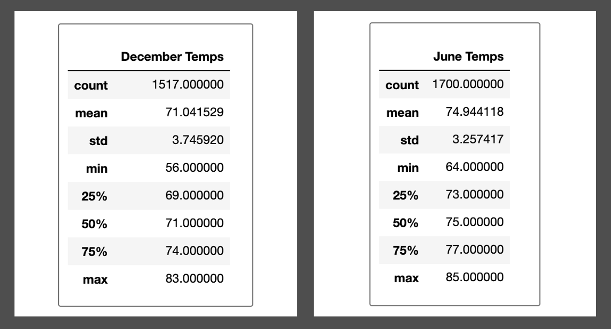

# surfs_up

## Purpose of the analysis
During my past vacation in the beautiful island of Hawaii I discovered a new passion. Surfing!
Life is too short for one not to live to the fullest. So I've decided I will pursue my dreams of everlasting stoke and will enbark on an endless summer journey. I will open a Surf and Ice Cream shack in Hawaii and live there to the end of times. 
While I do have a decent amount of savings to kickstart this endeavor, I will still need investor backing.
I met with a potential investor, W. Avy, and he is very interested on my proposal. Before fully committing, however, W.  Avy wants to see some data analysis about temperatures in Hawaii both in June and in December. He wants to be sure temperatures are high enough for the business to be hot, and for clients to be frothing for tasty waves and delicious ice creams.
To tackle W. Avy's request, I've performed data analysis on a temperature dataset that he has provided using Pandas and SQLite.

## Results

.

The analysis shows very promising information as follows:
 - The mean temperature both in June and December are well above 70 degrees. Given that most turists visiting the islands come from the continental US and that in the winter temperatures in the US are very frosty, we feel very confident that people will be very inclined to go trade getting brain freezes from our delicious ice creams rather than freezing themselves shoving snow out of their driveways.
 - The high temps both in the summer and winter are still above 80 degrees. What a beauty it is to be in the tropics. Clients will love to spend those hot and sunny days riding tasty waves in our beautiful shores.
 - Finally, we've analyzed thousands of data records to come up with our conclusion so we feel very confident that we are in for success!

## Summary 
In sum, we have a very compeling case for W. Avy. All data points tell us that the Surf and Shake shop will be a total hit!
In addition to looking at temperatures we could also analyze raining patterns, water temperature, and travel volume going into the island for a complete analysis.
In any case, I am doing this!

 
